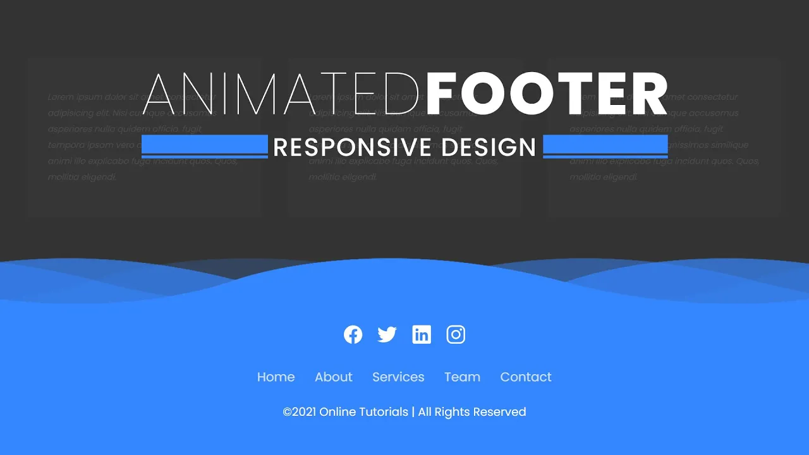

# Responsive Animated Website Footer


[](https://www.youtube.com/watch?v=UpkEANWC2Ms)




## Tabela de conteúdos

<!--ts-->

- [Sobre o projeto](#-sobre-o-projeto)
- [Tecnologias](#-tecnologias)
  - [WebSite](#website)
  - [Utilitários](#utilitários)
- [Layouts](#-layouts)
- [Como executar o projeto](#-como-executar-o-projeto)
  - [Pré-requisitos](#pré-requisitos)
- [Autor](#-autor)
- [Licença](#-licença)
<!--te-->

## 💻 Sobre o projeto

Responsive Animated Website Footer é um projeto que utiliza apenas HTML e CSS para criar ondas em movimento e em camadas no rodapé do site.

Para saber como foi realizado, acesse o [vídeo](https://www.youtube.com/watch?v=UpkEANWC2Ms) do canal [Online Tutorials](https://www.youtube.com/c/OnlineTutorials4Designers) no YouTube.

## 🛠 Tecnologias

As seguintes ferramentas foram usadas na construção do projeto:

#### **Website**

- HTML
- CSS

#### **Utilitários**

- Editor: **[Visual Studio Code](https://code.visualstudio.com/)** → Extensions: **[Live Server](https://marketplace.visualstudio.com/items?itemName=ritwickdey.LiveServer)**
- Ícones: **[Ionicons](https://ionic.io/ionicons)**
- Fontes: **[Poppins](https://fonts.google.com/specimen/Poppins?query=poppins)**

## 🎨 Layouts

<table>
  <thead>
    <tr>
      <th>Mobile</th>
      <th>Tablet</th>
      <th>Web</th>
    </tr>
  </thead>
  <tbody>
    <tr>
      <td></td>
      <td></td>
      <td></td>
    </tr>
  </tbody>
</table>

## 🚀 Como executar o projeto

### Pré-requisitos

Clone este repositório:

```bash
#HTTPS
$ git clone https://github.com/nathaliaveneziano/responsive-animated-website-footer.git

#SSH
$ git clone git@github.com:nathaliaveneziano/responsive-animated-website-footer.git
```

Acesse a pasta do projeto no terminal:

```bash
$ cd responsive-animated-website-footer
```


#### Abrindo direto no navegador

Basta clicar diretamento no arquivo `index.html` e abra no seu navegador de prefe6encia.


#### Acessando via VSCode

Abra o projeto no VSCode, caso queira abrir via terminal, só colocar o seguinte comando:

```bash
$ code .
```

Com o projeto aberto, rode o Live Server para ver o projeto em tempo real. Existem 3 formas de rodar o Live Server:
- Clique na barra inferior direita em `Live Server`
- Botão direito no arquivo `index.html` e selecione `Open with Live Server`
- Através do atalho ALT+L ALT+O e

Será aberta uma nova guia no seu navegador de preferencia, normalmente ele abre em `http://localhost:5500/`.

## 🦸 Autor


<br />
Nathália Veneziano
<br />

[](https://www.facebook.com/nathalia.veneziano.developer)
[](https://www.instagram.com/nathalia.veneziano.developer/)
[](https://www.linkedin.com/in/nathalia-veneziano)
[](https://twitter.com/nath_veneziano)

---

## 📝 Licença

Este projeto esta sobe a licença [MIT](./LICENSE).

Feito com ❤️ por Nathália Veneziano 👋🏽 [Entre em contato!](https://www.linkedin.com/in/nathalia-veneziano)
